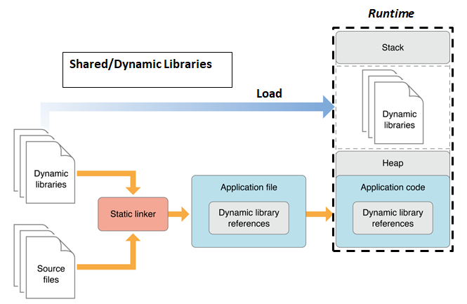

# Static Libraries and Shared Objects

## Libraries

- Một thư viện là tập hợp các file tiêu đề (.h) và các file thực thi(.c) được cung cấp để sử dụng bởi các chương trình khác. Giao diện của thư viện được thể hiện qua các file tiêu đề (header file) và nó chứa các nguyên mẫu hàm mà các chương trình khác có thể sử dụng. Cài đặt của thư viện thường nằm trong các file nguồn (.c file).

- Một thư viện có thể bao gồm một hoặc nhiều file đối tượng (object files), thường là các file .o, chứa mã nguồn đã được dịch.

- Nếu một hàm trong chương trình có thể được **sử dụng lại bởi nhiều ứng dụng khác**, hàm đó nên được đưa ra khỏi mã nguồn của ứng dụng và biên dịch thành thư viện, giúp nó có thể được tái sử dụng.

## Advantages of Libraries
- **Biên dịch nhanh**: Với thư viện, bạn không cần phải biên dịch lại mã nguồn của tất cả các phụ thuộc khi biên dịch chương trình. Bạn chỉ cần liên kết đến thư viện đã được biên dịch sẵn (thư viện tĩnh .a hoặc thư viện động .so).

- **Tái sử dụng phần mềm**: Thư viện giúp chia sẻ và tái sử dụng mã đã được kiểm thử và đảm bảo hoạt động. Điều này làm tăng độ tin cậy và hiệu quả của mã.

- **Phát triển theo module**: Giúp tách biệt các thành phần, giảm thiểu phụ thuộc và tăng khả năng bảo trì mã. Bạn có thể chia mã thành các module chuyên biệt, mỗi module chịu trách nhiệm cho một nhiệm vụ nhất định như xử lý nhập/xuất, mạng, hoặc điều khiển cảm ứng.

- **Quản lý phiên bản**: Các phiên bản cũ và mới của thư viện có thể tồn tại đồng thời trên cùng một hệ thống.

- **Chuyên môn hóa**: Các nhà phát triển có thể tập trung vào các thư viện hoặc các phần cụ thể, thay vì phải làm việc với toàn bộ chương trình lớn. 

## Linking
- **Liên kết** là quá trình thu thập và kết hợp tất cả các file **obiect(.o) hoặc (.obj)** đã được 
biên dịch thành một file **thực thi duy nhất**.Đây là bước kết hợp mã của các thư viện hoặc 
các phần phụ thuộc bên ngoài vào chương trình chính để tạo thành một chương trình có thể chạy
- **Liên kết tĩnh(Static linking)** :
    - **Liên kết tĩnh** là khi toàn bộ mã nguồn của các thư viện được sao chép trực tiếp vào chương trình trong quá trình biên dịch
    - Điều này có nghia là các hàm từ thư viện sẽ nằm trong chương trình thực thi, và không cần phải phụ thuộc vào thư viện bên ngoài khi chạy
    - Ưu điểm : Chương trình **chạy nhanh hơn** vì không phải tìm kiếm các thư viện ngoài tại thời điểm chạy.Chương trình khong cần thư viện bên ngoài 
    để hoạt động.
    - Nhược điểm : File thực thi có **kích thước lớn hơn** vì chứa toàn bộ mã của thư viện.Nếu có thay đổi trong thư viện, bạn phải biên dịch lại toàn bộ chương trình

- **Liên kết động(Dynamic Linking or Shared Linking)** :
    - Liên kết động chỉ đưa tên của thư viện (tức là để tham chiếu đến thư viện đó) do đó mã
    của thư viện chỉ có thể được tải vào khi chương trình bắt đầu chạy.
    - Các thư viện động(Shared objets `.so`) được nạp vào bộ nhớ khi chương trình cần chúng.
    - Ưu điểm : File thực thi **nhỏ hơn** và có thể cập nhật thư viện mà không cần biên dịch lại chương trình.Các chương trình khác nhau có thể chia sẻ cùng một bản sao
    của thư viện tiết kiệm tài nguyên hệ thống.
    - Nhược điểm: Thời gian chạy lâu hơn do trong quá trình chạy nó mới tham chiếu đến các thư viện.Nếu thiếu thư viện khi chạy chương trình,
    chương trình sẽ bị lỗi.

## So sánh giữa Liên kết tinh và Liên kết động
- **Liên kết tĩnh** giúp chương trình độc lập, nhưng kích thước sẽ lớn và khó khăn khi cập nhật thư viện
- **Liên kết động** giúp tiết kiệm tài nguyên và dễ dàng cập nhật, nhưng phụ thuộc vào việc các thư viện cho sẵn trên hệ thống tại thời điểm chạy.