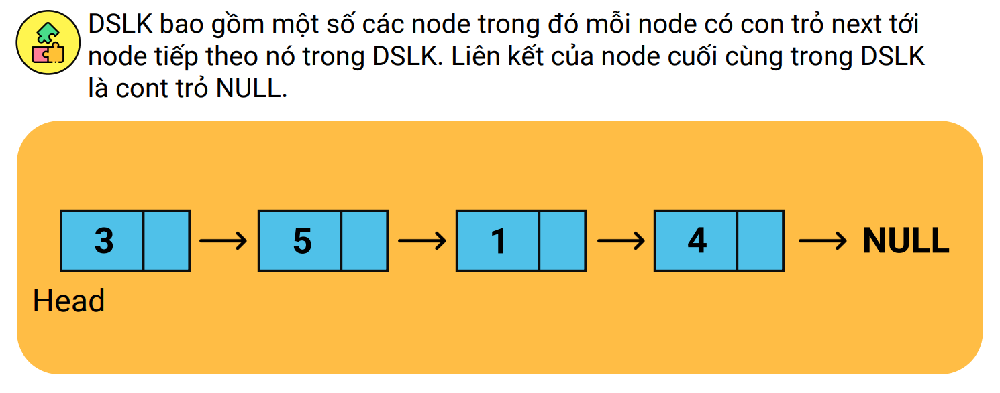
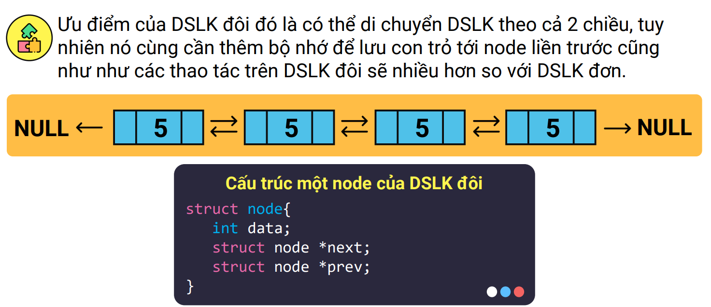
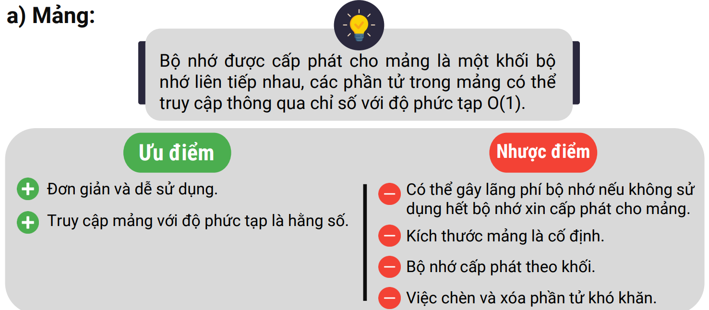
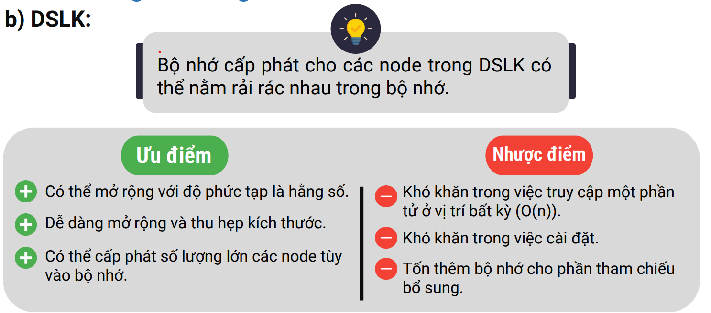
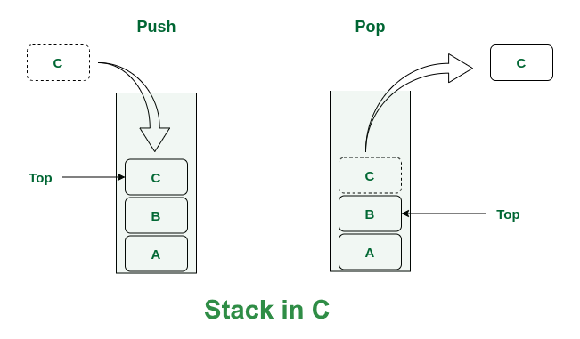
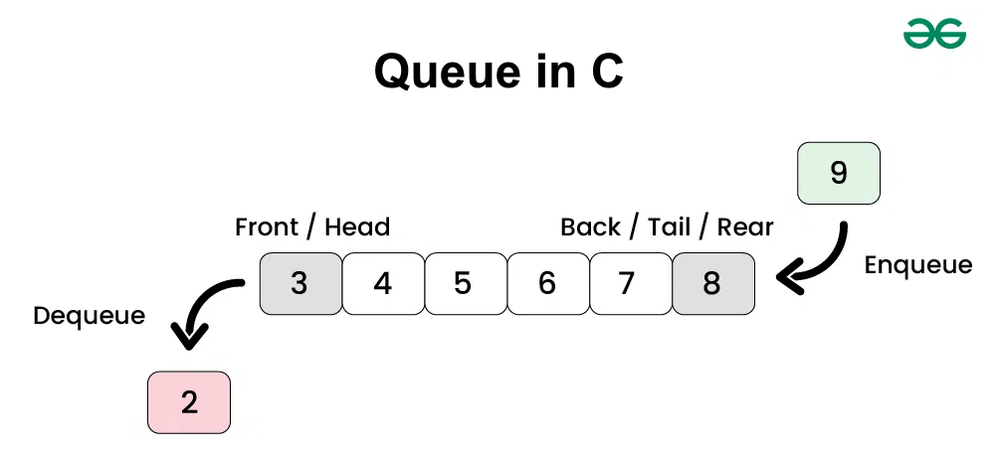

# Cấu trúc dữ liệu

## Linked list 
- **Linked list** (danh sách liên kết)  là một cách để lưu trữ dữ liệu.
Nó có thể lưu trữ **nhiều loại dữ liệu khác nhau**. Đây là cấu trúc dữ liệu được sử dụng nhiều thứ hai, sau mảng (array). 
- Trong C không có kiểu dữ liệu danh sách liên kết, vì vậy bạn cần phải tự tạo ra nó. Danh sách liên kết là một cấu trúc dữ liệu tuyến tính. Tuyến tính nghĩa là nó có thứ tự và nối từ phần tử này sang phần tử khác. 
Nó là một chuỗi các cấu trúc dữ liệu được kết nối với nhau qua các liên kết (`links`) hoặc nút (`nodes`).
- Nếu nhìn một cách trừu tượng, bạn có thể hình dung nó như những nút và liên kết kết nối với nhau cho mỗi phần tử trong tập dữ liệu. 
Mỗi liên kết chứa dữ liệu của phần tử đó. Có nhiều loại danh sách liên kết khác nhau, 
nhưng chúng ta sẽ tập trung chủ yếu vào **danh sách liên kết đơn (singly linked list)**.

    - Danh sách liên kết đơn nghĩa là bạn chỉ có thể duyệt từ đầu đến cuối, chỉ có thể **đi một chiều** (forward).
    - Danh sách liên kết đôi (doubly linked list) cho phép bạn đi **cả hai chiều**, tức là có thể đi cả tiến (forward) và lùi (backward). 
    Để thực hiện điều này, bạn sẽ có nhiều con trỏ. Một con trỏ chỉ về phần tử trước và một con trỏ chỉ về phần tử sau, cho phép bạn di chuyển theo cả hai hướng.
- Danh sách liên kết là **động (dynamic)**, nghĩa là độ dài của danh sách có thể **tăng hoặc giảm tùy theo nhu cầu**. Đây là một ưu điểm lớn. Mảng (arrays) không phải là động, chúng là tĩnh. 
Bạn phải xác định kích thước của mảng khi khai báo, và sau đó bạn không thể thay đổi nó.
- Đó là lý do vì sao đôi khi bạn gặp lỗi **segmentation fault** hoặc lỗi **vượt quá giới hạn mảng (array out of bounds)** trong các ngôn ngữ khác. Bạn không thể tự do thay đổi kích thước của mảng. 
Với `malloc` và `realloc` trong C, bạn có thể thay đổi kích thước bộ nhớ một cách động, nhưng điều này không dễ. Trong khi đó, với danh sách liên kết, bạn có thể dễ dàng thêm hoặc xóa các phần tử tại thời gian chạy mà không cần biết trước kích thước.
- Một danh sách liên kết có thể được sử dụng khi bạn **không biết trước số lượng phần tử dữ liệu cần lưu trữ**. Một nút hoặc một liên kết có thể chứa dữ liệu với **bất kỳ kiểu nào**, bao gồm cả các đối tượng kiểu cấu trúc khác. 
Một lợi thế khác của danh sách liên kết là bạn có thể lưu trữ **các kiểu dữ liệu khác nhau**, ví dụ: int, float, hoặc thậm chí là các cấu trúc.
- So sánh `single linked list` và `double linked list` 
    - single linked list

    - double linked list

- So sánh giữa `Array` và `Linked list`
    - Advantages and Disadvantages of Array
    
    - Advantages and Disadvantages of Linked list
    
### Single linked list
- Cấu trúc một node của danh sách liên kết ví dụ dưới đây là 1 danh sách liên kết với kiểu dữ liệu là `int`
```C
struct node{
    int data;
    struct node *next; // link
};
```

Ý nghĩa của cấu trúc node:
- Node ở đây có phần dữ liệu là một số
nguyên lưu ở data, ngoài ra nó còn có 1
phần con trỏ tới chính struct node.
Phần này chính là địa chỉ của node tiếp
theo của nó trong DSLK.
- Như vậy mỗi node sẽ có **dữ liệu của nó
và có địa chỉ của node tiếp sau nó**. Đối
với con trỏ cuối cùng trong DSLK thì
phần địa chỉ này sẽ là con trỏ NULL.
- Mỗi node trong DSLK đều được **cấp phát động**

Tạo một node mới:
```C
struct node* createNode(int val)
{
    // cap phat dong 1 node
    struct node* newnode = (struct node *)malloc(sizeof(struct node));
    if (newnode == NULL)
    {
        printf("\nMemory was not allocated");
        return 0;
    }
    else
    {
        newnode->value = val;
        newnode->next = NULL;
        return newnode;
    }
}
```
#### Các thao tác với danh sách liên kết đơn
- Với head lưu địa chỉ của node đầu và tail lưu địa chỉ của node đuôi
```C
struct node *newnode, *ptr, *prev, *temp;
struct node *head = NULL, *tail = NULL;
```
- Chèn 1 node vào đầu danh sách liên kết với head là node đầu , tail là node đuôi
```C
void insertNodeAtTheBeginning()
{
    int val = 0;

    printf("\nEnter the value for the node: ");
    scanf("%d", &val);
    newnode = createNode(val);
    // neu danh sach lien ket chua co phan tu nao , node moi tro thanh node dau tien
    if (head == tail && head == NULL)
    {
        head = tail = newnode;
        head->next = NULL;
        tail->next = NULL;
    }
    else
    {
        temp = head;
        head = newnode;
        head->next = temp;
    }
}
```
- Chèn 1 node vào cuối danh sách
```C
void insertNodeAtTheEnd()
{
    int val = 0;

    printf("\nEnter the value for the Node: ");
    scanf("%d", &val);
    newnode = createNode(val);
    // neu danh sach rong
    if (head == tail && tail == NULL)
    {
        head = tail = newnode;
        head->next = NULL;
        tail->next = NULL;
    }
    // cho link cua node cuoi tro den newnode và tail node = newnode
    else
    {
        tail->next = newnode;
        tail = newnode;
        tail->next = NULL;
    }

 printf("\n----INSERTED----");
}
```
- Chèn vào 1 vị trí bất kỳ
```C
void insertNodeAtPosition()
{
    int pos, val, cnt = 0, i;

    printf("\nEnter the value for the Node: ");
    scanf("%d", &val);
    newnode = createNode(val);
    printf("\nEnter the position ");
    scanf("%d", &pos);
    ptr = head;
    while (ptr != NULL)
    {
        ptr = ptr->next;
        cnt++;
    }
    // neu vi tri chen o dau danh sach
    if (pos == 1)
    {
        if (head == tail && head == NULL)
        {
            head = tail = newnode;
            head->next = NULL;
            tail->next = NULL;
        }
        else
        {
            temp = head;
            head = newnode;
            head->next = temp;
        }
        printf("\nInserted");
    }
    // neu vi tri chen o giua den cuoi danh sach
    else if (pos>1 && pos<=cnt)
    {
        // duyet den vi tri can chen
        ptr = head;
        for (i = 1;i < pos;i++)
        {
            prev = ptr;
            ptr = ptr->next;
        }
        // chen node moi
        prev->next = newnode;
        newnode->next = ptr;
        printf("\n----INSERTED----");
    }
    // neu vi tri chen khong hop le 
    else
    {
        printf("Position is out of range");
    }
}
```
- Xóa 1 node khỏi danh sách liên kết
```C
void deletePosition()
{
    int pos, cnt = 0, i;

    if (head == NULL)
    {
        printf("List is empy\n");
        printf(":No node to delete\n");
    }
    else
    {
        printf("\nEnter the position of value to be deleted: ");
        scanf(" %d", &pos);
        ptr = head;
        if (pos == 1)
        {
            head = ptr->next; // bo node dau tien di
            printf("\nElement deleted");
        }
        else
        {
            while (ptr != NULL)
            {
                ptr = ptr->next;
                cnt = cnt + 1;
            }
            // prev la node phia truoc , ptr la node hien tai
            if (pos > 0 && pos <= cnt)
            {
                ptr = head;
                for (i = 1;i < pos;i++)
                {
                    prev = ptr;
                    ptr = ptr->next;
                }
                // bo qua node hien tai la pos
                prev->next = ptr->next; // prev tro den node sau node hien tai la ptr->next
            }
            else
            {
                printf("Position is out of range ");
            }
        free(ptr);
        printf("\nElement deleted");
        }
    }
}
```
### Double linked list
-------------------to be continute------------------------
## Stack
- Stack là cấu trúc dữ liệu tuyến tính khép kín theo nguyên tắc **Vào cuối, Ra trước (LIFO - Last In First Out)** để chèn và xóa dữ liệu.
Nó có nghĩa là phần tử được chèn cuối cùng sẽ là phần tử đầu tiên bị xóa và phần tử được chèn trước đó sẽ bị xóa cuối cùng.

- Một ngăn xếp được tham chiếu qua con trỏ đến phần tử trên cùng của ngăn xếp.Thành phần liên kết trong node cuối cùng của ngăn xếp được đặt thành null để chỉ ra đáy của ngăn xếp,
việc không đặt liên kết trong nút đáy của ngăn xếp thành null có thể dẫn đến lỗi trong thời gian chạy.
- Ngăn xếp và danh sách liên kết được đại diện giống nhau.Sự khác biệt là các thao tác chèn và xóa có thể xảy ra ở bất kỳ đâu trong danh sách liên kết,còn với ngăn xếp thì chỉ ở đỉnh của ngăn xếp, đó là sự khác biệt.
- Một số **ứng dụng** của Stack:
    - Ngăn xếp **hỗ trợ đệ quy**, các cuộc gọi hàm đệ quy.Khi một cuộc gọi được thực hiện, hàm cần biết cách trở về hàm gọi của nó,do đó, địa chỉ trả về được đưa vào ngăn xếp.
Nếu một loạt các cuộc gọi hàm xảy ra,các giá trị trả về liên tiếp được đẩy vào ngăn xếp theo thứ tự cuối vào, đầu ra để mỗi hàm có thể trở về hàm gọi của nó.
Vì vậy, đệ quy thường được triển khai trên một ngăn xếp nào đó.
    - Chúng ta cũng nghe thấy thuật ngữ **"ngăn xếp cuộc gọi" (call stack)** vì nó sử dụng một ngăn xếp cho tất cả các cuộc gọi hàm, đó là cách nó được triển khai.
Ngăn xếp được sử dụng để lưu trữ dữ liệu trong bộ nhớ.Chúng chứa không gian được tạo ra cho các biến tự động khi mỗi hàm được gọi,
.Khi hàm trả về, không gian cho các biến đó được lấy ra khỏi ngăn xếp,đó là cách dễ nhất để thực hiện bộ nhớ ngăn xếp.
    - Ngăn xếp có thể được sử dụng khi triển khai **lịch sử các trang đã truy cập** trong trình duyệt web.
    - Ngăn xếp có thể được sử dụng trong một **thao tác hoàn tác** (undo) trong trình soạn thảo văn bản.Bạn chỉ cần hoàn tác thao tác cuối cùng mà bạn đã thực hiện.
nếu bạn đang gõ và gõ và gõ và bạn muốn thực hiện thao tác hoàn tác lần cuối,thao tác cuối cùng đã được thêm vào là thao tác bạn sẽ hoàn tác.
- Các thao tác chính trên Stack bao gồm:
    - `push` : thêm hoặc chèn một phần tử mới và đặt nó lên trên đỉnh của ngăn xếp.
    - `pop` : xóa phần tử khỏi đỉnh của ngăn xếp.Nó giải phóng bộ nhớ đã được cấp phát và trả về phần tử đó.
    - `isEmpty` : kiểm tra xem ngăn xếp có rỗng không.
    - `peek` : xem phần tử ở trên cùng mà không xóa nó.
- Triển khai :

Để thực hiện stack ta cần 1 cấu trúc giống với linked list vậy
```C 
struct Node{
    int data;
    struct Node* link;
};
struct Node* top;
```
- Push
```C 
void push(int data){
    struct Node* temp = (struct Node*) malloc(sizeof(Node));

    if(temp != NULL){
        temp->data = data;
        temp->link = top; // day top xuong duoi
        top = temp; // phan tu moi se la dinh ngan xep
    }
}
```
- isEmpty
```C 
int isEmpty(){
    return top == NULL;
}
```
- pop
```C 
void pop(){
    struc Node *temp;

    if(top != NULL){
        temp = top;
        top = top->link; // xoa phan tu o dinh ngan xep
        temp->link = NULL; 
        free(temp); // giai phong temp tranh ro ri bo nho
    }
}
```
- display
```C 
void display(){
    struct node* temp;

    if(top != NULL){
        temp = top;
        while(temp != NULL){
            printf("%d:\n",temp->data);
            temp = temp->link;
        }
    }
}
```
## Queues
- Queuse hay hay hàng đợi là một cấu trúc dữ liệu phổ biến được sử dụng nhiều trong khoa học máy tính và lập trình.
- Quese đối lập với Stack, các phần tử của hàng đợi chỉ được loại bỏ từ đầu hàng(head).Các phần tử hàng đợi chỉ được thêm vào cuối hàng (tail).Vì lý do này, hàng đợi được gọi là cấu trúc dữ liệu **"vào trước ra trước - FIFO (First In, First Out)"**
- Ứng dụng :
    - Hàng đợi cũng được sử dụng để hỗ trợ việc **in ấn (print spooling)**. Trong môi trường nhiều người dùng, có thể chỉ có một máy in duy nhất. Nhiều người dùng có thể tạo ra lệnh in, và nếu máy in đang bận, các lệnh in này sẽ được xếp vào hàng đợi, đợi đến khi máy in sẵn sàng.
    - Một ví dụ khác là khi các **gói thông tin đợi trong hàng đợi trên mạng máy tính**. Mỗi khi một gói tin đến một nút mạng, nó phải được định tuyến đến nút tiếp theo. Nút định tuyến sẽ định tuyến từng gói tin một. Các gói tin thêm vào sẽ được xếp hàng chờ đến khi có thể được định tuyến.
- Các thao tác chính trên Quese:
  - `enqueue` (offer) : thêm vào phần tử
  - `dequeue` (poll) : loại bỏ phần tử
  - `IsEmpty` : kiểm tra xem hàng đợi có rỗng không
  - `IsFull` : kiểm tra xem hàng đợi đã đầy chưa

- Quese(hàng đợi) có thể được thực hiện theo cách này hoặc cách khác, thông qua mảng hoặc danh sách liên kết, và có thể có nhiều cách khác nữa.
### Dùng linked list
- Khởi tạo QNode và tạo Queue do ta chỉ quan tâm đến phần tử đầu và cuối của Queue. Việc giữ các con trỏ `*front` và `*rear` giúp chúng ta thực hiện các thao tác enqueue và dequeue với độ phức tạp thời gian là O(1). 
Điều này có nghĩa là thời gian thực hiện các thao tác này là không đổi, không phụ thuộc vào số lượng phần tử trong hàng đợi
```C 
struct QNode{
    int key;
    struct QNode* next;
};
struct Queue{
    struct QNode *front,*rear;
}
```
- newNode :Hàm newNode tạo ra một nút mới cho hàng đợi, gán giá trị cho trường key, và khởi tạo con trỏ next của nó là NULL. 
Hàm này sẽ được sử dụng khi bạn cần thêm một phần tử mới vào hàng đợi.
```C 
struct QNode* newNode(int k){
    struct QNode* temp=(struct QNode*)malloc(sizeof(struct QNode));
    temp->key = k;
    temp->next = NULL;
    return temp;
}
```

-createQueue : khởi tạo hàng đợi
```C
struct Queue* createQueue(){
    struct Queue* q = (struct Queue*)malloc(sizeof(struct Queue));
    q->front = q->rear = NULL;
    return q;
}
```
- enqueue : thêm một phần tử mới vào cuối queue
```C 
void enQueue(struct Queue* q,int k){
    struct QNode* temp = newNode(k);

    // if queue is empty,then new node is front and rear both
    if(q->rear == NULL){
        q->front = q->rear = temp;
        return ;
    }
    // add the new node at the end of queue and change rear
    q->rear->next=temp;
    q->rear=temp;
}
```
- deQueue : xóa 1 phần tử ra khỏi hàng đợi
```C 
struct QNode* deQueue(struct Queue* q){
    // if queue is empty return NULL
    if(q->front == NULL){
        return NULL;
    }
    //store previous front and move front one node ahead
    struct QNode* temp = q->front;
    q->front = q->front->next;

    //if front becomes NULL then change rear also as NULL => queue is empty
    if(q->front == NULL)
        q->rear = NULL;

    return temp;
}
```
### Dùng mảng
