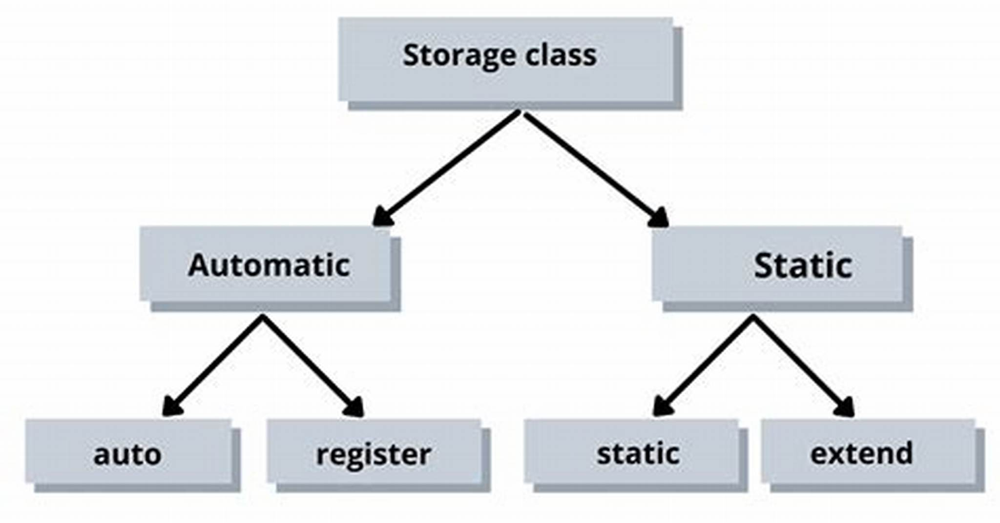

# Storage Classes
- Lớp lưu trữ được sử dụng để **mô tả các đặc tính của một biến hoặc hàm**.
    - Bao gồm **phạm vi (scope)**, **tầm nhìn (visibility)** và **vòng đời (lifetime)**.
    - Giúp theo dõi sự tồn tại của một biến cụ thể trong quá trình chạy của chương trình 
- Vòng đời của biến là khoảng thời gian mà biến tồn tại trong bộ nhớ của máy tính.
    - Một số biến tồn tại trong thời gian ngắn, một số khác được tạo và hủy nhiều lần, và một số tồn tại suốt thời gian chương trình chạy.
- Phạm vi của biến là nơi mà biến có thể được tham chiếu trong chương trình.
    - Một số có thể được tham chiếu trong toàn bộ chương trình, số khác chỉ từ một phần của chương trình.
- Tầm nhìn hoặc liên kết (linkage) của một biến xác định trong một chương trình nhiều tệp nguồn xem biến đó có chỉ được biết đến trong tệp nguồn hiện tại hay trong bất kỳ tệp nguồn nào với khai báo thích hợp.
- C cung cấp **bốn lớp lưu trữ**, mỗi lớp được định danh bởi một từ khóa nhất định:
    - `auto`
    - `register`
    - `extern`
    - `static`
- Phân loại theo Thời Gian Lưu Trữ
    - **Thời gian lưu trữ tự động (Automatic storage duration)**: Áp dụng cho `auto` và `register`. Biến chỉ tồn tại khi khối mã mà chúng được khai báo đang hoạt động.
    - **Thời gian lưu trữ tĩnh (Static storage duration)**: Áp dụng cho `static` và `extern`. Biến tồn tại trong suốt thời gian chương trình chạy.
    

## Local Variables
- Trong C, biến cục bộ là những biến được khai báo bên trong thân hàm hoặc một khối mã và chỉ có thể truy cập trong phạm vi hàm hoặc khối mã đó. Đặc điểm chính của chúng bao gồm:
    - **Thời Gian Lưu Trữ Tự Động** : Biến cục bộ mặc định có thời gian lưu trữ tự động, tức là chúng được tạo mỗi khi hàm được gọi và bị hủy khi hàm kết thúc.Điều này giúp tiết kiệm bộ nhớ vì biến chỉ tồn tại khi thực sự cần thiết.
    - **Phạm Vi Cục Bộ** : Giá trị của biến cục bộ chỉ có thể truy cập trong hàm nơi chúng được khai báo, không thể được truy cập từ các hàm khác.
    - **Khởi tạo lại khi gọi hàm** : Nếu biến cục bộ được gán một giá trị khởi tạo, giá trị này sẽ được gán lại mỗi khi hàm được gọi. Điều này có nghĩa là biến cục bộ sẽ bắt đầu với cùng giá trị khởi tạo trong mỗi lần gọi hàm, giúp duy trì tính nhất quán của dữ liệu và hành vi của hàm trong suốt quá trình thực thi.

## Auto
### Overview
- Trình biên dịch C **mặc định coi rằng bất kỳ biến nào được định nghĩa bên trong một hàm là biến cục bộ tự động**.
Từ khóa `auto` hiếm khi được sử dụng.
- Trong C++, từ khóa `auto` đã được sử dụng lại cho một mục đích khác, vì vậy tránh dùng `auto` làm chỉ thị lớp lưu trữ giúp đảm bảo tính tương thích giữa C và C++.
- Tuy nhiên, bạn có thể làm rõ ý định bằng cách sử dụng từ khóa `auto` trước khi định nghĩa biến.Điều này giúp tài liệu hóa rằng bạn đang cố tình ghi đè một biến được định nghĩa bên ngoài.Hoặc để nhấn mạnh rằng không nên thay đổi biến này sang một lớp lưu trữ khác.
### Why use Auto?
- Bộ nhớ tự động là một cách để tiết kiệm bộ nhớ.
Biến tự động chỉ tồn tại khi cần thiết.
- Chúng được tạo khi hàm mà chúng được định nghĩa trong được gọi.
- Chúng bị hủy khi hàm kết thúc.
- Bộ nhớ tự động là một ví dụ của nguyên tắc hạn chế quyền truy cập.
- Chỉ cho phép truy cập dữ liệu khi thực sự cần thiết.
- Tại sao lại lưu biến trong bộ nhớ và cho phép truy cập khi chúng không thực sự cần?
### Syntax
- **Các lớp lưu trữ được đặt trước kiểu của biến.**
- Để chỉ định lớp lưu trữ cho một biến, cú pháp sau đây cần được tuân thủ:
```C
storage_class var_data_type var_name;
```
Khai báo sau cho biết rằng các biến kiểu double x và y là các biến cục bộ tự động.
Chúng chỉ tồn tại trong thân hàm nơi khai báo xuất hiện:
```C
auto double x, y;
```
## Entern
### Overview
- Từ khóa `extern` là rất quan trọng để cho phép giao tiếp giữa các tệp khác nhau trong một chương trình C.
- Biến `extern` được khai báo bằng từ khóa `extern`, chỉ ra rằng định nghĩa của nó **nằm ở một tệp hoặc phạm vi khác**. Điều này cho phép biến được sử dụng trong nhiều tệp của chương trình.
- Biến `extern` thực chất là biến toàn cục. Chúng được khởi tạo với một giá trị hợp lệ khi khai báo, khiến chúng có thể truy cập được trong toàn bộ chương trình. Điều này đặc biệt hữu ích trong các chương trình lớn được chia thành nhiều tệp.
### Syntax
- Để sử dụng một biến `extern` trong một tệp, bạn phải khai báo nó với từ khóa `extern` trong tệp đó. Điều này cho compiler biết rằng biến được định nghĩa trong một tệp khác.
- Ví dụ tronh 1 file ban đầu ta khai báo :
```C
int moveNumber = 0; // Định nghĩa biến global
```
Trong các file khác file gốc trên có thể truy cập biến `moveNumber`bằng cách khai báo :
```C
extern int moveNumber; // Khai báo biến extern
```
- Lưu ý biến được khai báo thêm từ khóa `extern` không thể được khởi tạo lại.

### Extern with function
- Từ khóa `extern` cũng được dùng với hàm với mục đích tương tự
- Bản chất khi khai báo nguyên mẫu hàm mà ta hay dùng chính là đang sử dụng biến `extern`.(Khai báo nguyên mẫu hàm : Là cách mà bạn cho trình biên dịch biết rằng có một hàm với tên và kiểu tham số cụ thể, nhưng không cần phải chỉ rõ hàm đó được định nghĩa như thế nào ngay tại chỗ khai báo).Ta thường khai báo nguyên mẫu hàm khi định nghĩa của nó ở ngay hàm đó chẳng hạn như :

```C
#include <stdio.h>

void func(void);

int main(){
    func();
    return 0;
}

void func(void){
    printf("This is a line.");
}
```
Nhưng bản chất khi ta khai báo nguyên mẫu hàm ở các hàm khác nhau vẫn được không nhất thiết phải ở cùng một file.

- Khi khai báo nguyên mẫu hàm :
```C
int foo(int arg1, char arg2);
```
Bản chất là đã ngầm định nghĩa:

```C
extern int foo(int arg1, char arg2);
```


- Trình biên dịch hiểu rằng hàm `foo` tồn tại, nhưng nó có thể được định nghĩa ở một nơi khác trong chương trình hoặc chính file hiện tại.Điều này cho phép bạn gọi hàm `foo` ở bất kỳ đâu trong tệp hiện tại mà không cần biết chi tiết định nghĩa của nó ngay lập tức.

## Static 
### Overview
- Từ khóa `static` trong C có nhiều ý nghĩa khác nhau cho các trường hợp khác nhau.Nó có thể được dùng cho biến cục bộ, biến toàn cục và hàm.
- Khi bạn khai báo một biến với từ khóa `static` bên trong một hàm( biến cục bộ ), biến đó sẽ có **thời gian tồn tại (lifetime)** kéo dài suốt thời gian chạy của chương trình, nhưng **phạm vi (scope)** của nó chỉ giới hạn trong hàm mà nó được khai báo - Tức là giá trị của nó sẽ được lưu lại và không biến mất qua các lần gọi hàm.
- Khi bạn khai báo một biến `static` bên ngoài các hàm, nó sẽ có phạm vi truy cập giới hạn trong file hiện tại. Điều này có nghĩa là các tệp khác trong dự án không thể truy cập biến đó.
- Khi bạn khai báo một hàm với từ khóa `static`, phạm vi của hàm đó cũng sẽ chỉ giới hạn trong tệp mà nó được định nghĩa. Các tệp khác không thể gọi hàm đó, ngay cả khi sử dụng từ khóa `extern`.

## Register
### Overview
- **Thanh ghi bộ xử lý (CPU register)** là một tập hợp nhỏ các vùng lưu trữ dữ liệu thuộc về bộ xử lý máy tính.
- Một thanh ghi có thể chứa một lệnh, một địa chỉ lưu trữ hoặc bất kỳ loại dữ liệu nào
- Lớp lưu trữ `register` trong C được sử dụng để khai báo **các biến cục bộ - local variables(điều này giống auto)** mà **nên được lưu trữ trong thanh ghi (register) của CPU thay vì RAM.**
- **Ưu điểm của biến register**
    - **Truy xuất nhanh hơn:** Do thanh ghi có tốc độ truy xuất nhanh hơn nhiều so với bộ nhớ RAM
    - **Tăng hiệu suất chương trình:** Thích hợp cho các biến được truy cập thường xuyên, **giúp giảm thời gian truy cập bộ nhớ.**
- `register` **chỉ là một gợi ý, không phải bắt buộc**. Khi khai báo một biến với từ khóa register, điều đó chỉ gợi ý cho trình biên dịch rằng biến này nên được lưu trong một thanh ghi của CPU để tăng tốc độ truy xuất.Tuy nhiên, trình biên dịch có thể bỏ qua yêu cầu này nếu:
    - CPU không có đủ thanh ghi trống  hoặc compiler thấy rằng lưu biến trong RAM sẽ tối ưu hơn, nó sẽ tự động lưu biến đó vào bộ nhớ như một biến bình thường.
    - Compiler có chiến lược tối ưu hóa khác hiệu quả hơn.
- **Trình biên dịch hiện đại tự động tối ưu hóa**: 
    - Trong các trình biên dịch hiện đại (như GCC, Clang), trình biên dịch tự động quyết định biến nào nên lưu trong thanh ghi mà không cần từ khóa register.
    - Do đó, việc sử dụng register trong C hiện nay ít phổ biến vì trình biên dịch có thể tự tối ưu hóa tốt hơn.
- **Không thể lấy địa chỉ của biến register** :
    - Vì biến register có thể không nằm trong RAM, nên **không thể lấy địa chỉ của biến `register` bằng toán tử &.**
    - Điều này có nghĩa là **không thể sử dụng con trỏ để trỏ tới biến `register`.**