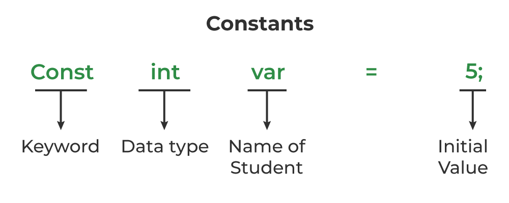
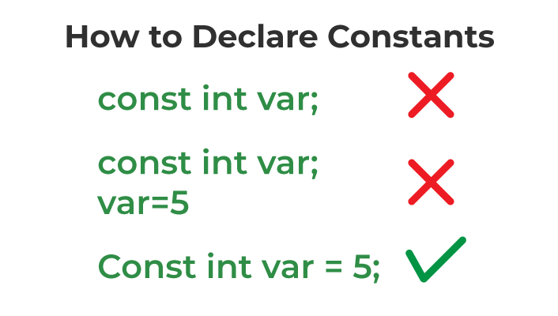

# Overview
-  `Type qualifiers` có thể được sử dụng trước các biến để cung cấp cho trình biên dịch thêm **thông tin về mục đích sử dụng của biến** mụch đích giúp tối ưu hóa
- Các `Type qualifiers` bao gồm : `const` ,`volatile`,`restrict`
## Const
- Nếu một biến được khai báo với từ khóa `const` thì nó có thể cho trình biên dịch biết rằng các biến được chỉ định có **giá trị không đổi trong suốt quá trình thực thi chương trình**
- Nếu cố gắng gán một giá trị cho biến `const` sau khi khởi tạo trình biên dịch có thể đưa ra thông báo lỗi.
- Một trong những nguyên lý đó là từ khóa `const` cho phép trình biên dịch đặt các biến `const` **vào bộ nhớ chỉ đọc(Read-only memory).**
### Const vs. Define
- `#define` là một chỉ thị tiền xử lý còn `const` chỉ là một từ khóa
- Biến `const` có tất cả các đặc điểm giống như một biến bình thường, ngoại trừ việc nó không thể thay đổi giá trị sau khi khởi tạo. Điều này có nghĩa là bạn có thể truyền biến const vào các hàm, ép kiểu (typecast) nó, và làm bất kỳ điều gì khác mà bạn có thể làm với biến bình thường.
- `const` xử lý bằng trình biên dịch còn `#define` được xử lý bởi bộ tiền xử lý
    - Một lợi thế lớn của `const` so với `#define` là khi bạn khai báo một biến const, trình biên dịch sẽ kiểm tra kiểu dữ liệu. Nếu có bất kỳ lỗi nào liên quan đến kiểu (type mismatch), trình biên dịch sẽ phát hiện và cảnh báo bạn.
    - `#define` chỉ đơn giản là một thay thế văn bản trước khi biên dịch. Không có kiểm tra kiểu với `#define`, vì vậy nếu có bất kỳ lỗi nào liên quan đến kiểu, bạn có thể gặp lỗi mà không nhận được cảnh báo rõ ràng từ trình biên dịch.
- Phạm vi hoạt động của một biến `const` cũng giống như một biến bình thường
### syntax
- Cấu trúc của việc khai báo biến `const` như sau:

- Các biến `const` trong C là bất biến sau khi định nghĩa, tức là chúng chỉ có thể được khởi tạo một lần trong toàn bộ chương trình. Sau đó, chúng ta không thể sửa đổi giá trị được lưu trữ bên trong biến đó.

### Ví dụ
- Ví dụ 1:
```C
// C Program to demonstrate the behaviour of constant
// variable
#include <stdio.h>

int main()
{
    // declaring a constant variable
    const int var;
    // initializing constant variable var after declaration
    var = 20;

    printf("Value of var: %d", var);
    return 0;
}
```
Output
```C
In function 'main':
10:9: error: assignment of read-only variable 'var'
10 |     var = 20;
     |         ^
```
### const and pointer
Trong C từ khóa const có thể được sử dụng với con trỏ (pointer) để kiểm soát tính không thay đổi của dữ liệu mà con trỏ trỏ tới hoặc chính bản thân con trỏ.Điều này phụ thuộc vào **vị trí của từ khóa `const` và  ký hiệu khi khai bóa con trỏ `*`**
- **Con trỏ tới một giá trị không thay đổi**: Khi bạn khai báo một con trỏ mà không cho phép thay đổi giá trị mà nó trỏ tới, bạn sử dụng `const` trước `*`
```C
const int *ptr; // cách 1
int const *ptr;  // cách 2
// ptr không thể thay đổi giá trị mà nó trỏ tới
```
- **Con trỏ không thay đổi giá trị của chính nó** : Khi bạn muốn ngăn không cho con trỏ thay đổi vị trí mà nó trỏ tới, bạn có thể đặt `const` sau dấu `*`
```C
int * const ptr;
// ptr không thể trỏ tới một địa chỉ khác
```
- **Con trỏ tới một giá trị không thay đổi và con trỏ không thay đổi** : Cách này kết hợp cả 2 cách trên 
```C
const int * const ptr;
// ptr không thể thay đổi giá trị mà nó trỏ tới và cũng không thể trỏ tới một địa chỉ khác
```


## volatile
## restrict